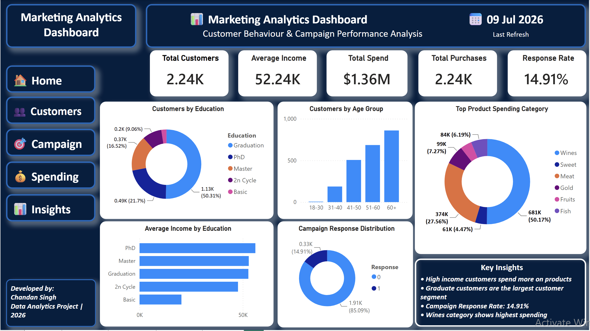
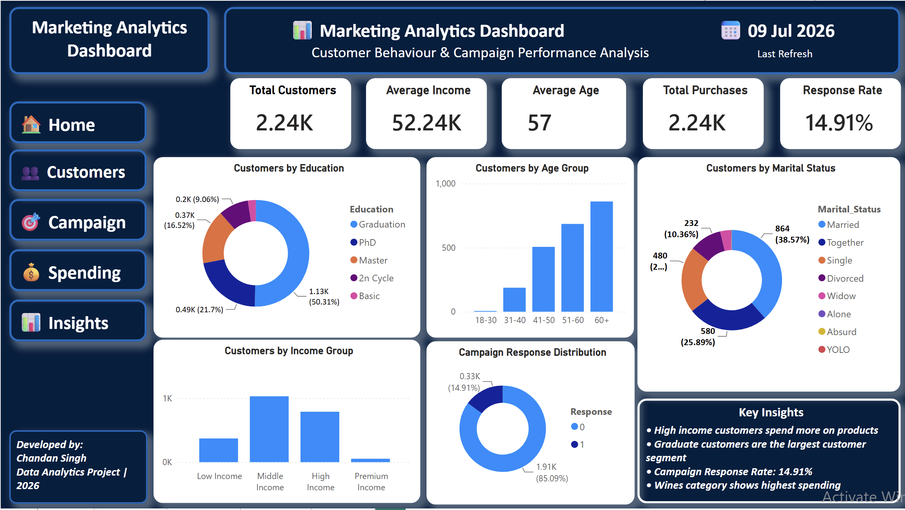
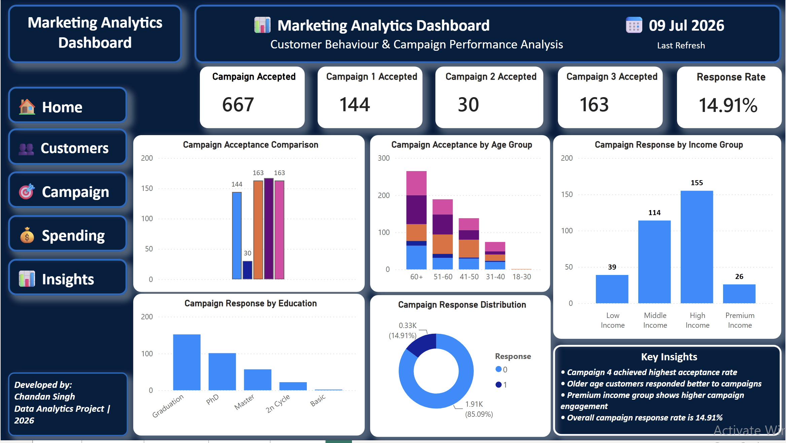
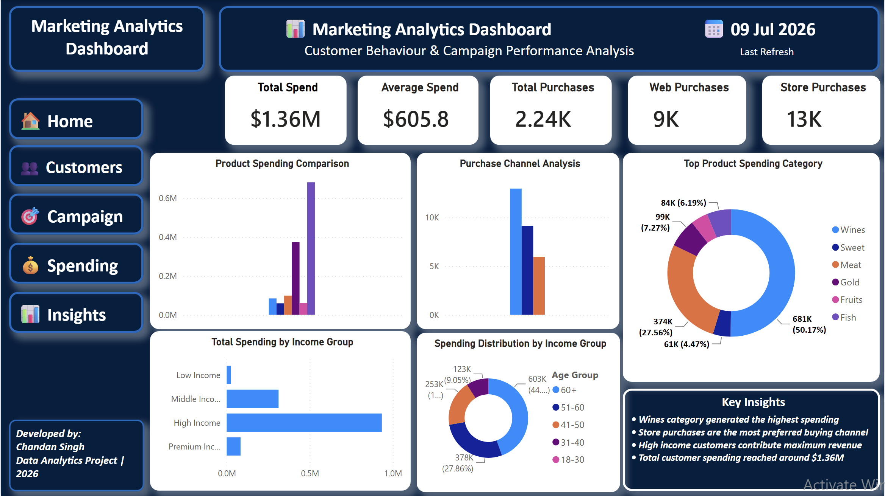
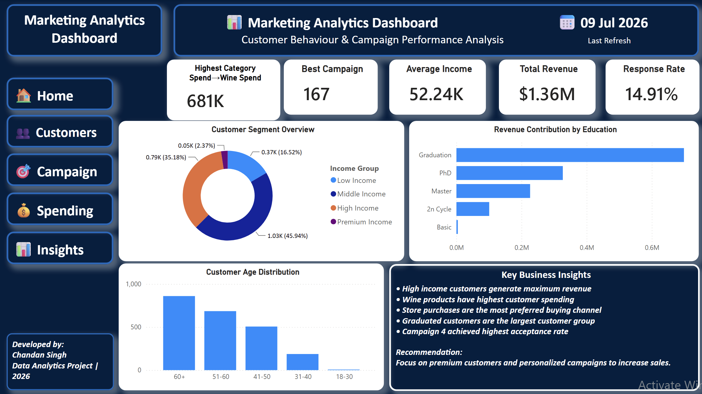

# 📊 Marketing Analytics Dashboard | Power BI Project

## Dashboard Preview

### 🏠 Home

### 👥 Customer Analysis

### 🎯 Campaign Analysis

### 💰 Spending Analysis

### 📈 Business Insights

---

## Project Overview

This Power BI dashboard analyzes customer behaviour, marketing campaign effectiveness, product spending patterns and customer segmentation.
# Marketing Analytics Dashboard | Power BI Project

## Project Overview
This Power BI dashboard analyzes customer behaviour, marketing campaign effectiveness, product spending patterns and customer segmentation.

## Tools Used
- Power BI
- Power Query
- DAX
- Data Visualization
- Data Analysis

## Dashboard Pages
1. Home Overview
2. Customer Analysis
3. Campaign Performance
4. Spending Analysis
5. Business Insights

## Key Insights
- High income customers generate maximum revenue.
- Wine category shows highest customer spending.
- Store purchases are the most preferred buying channel.
- Campaign performance analysis helps improve targeting strategy.

## Developed By
Chandan Singh
Data Analytics Project | 2026
